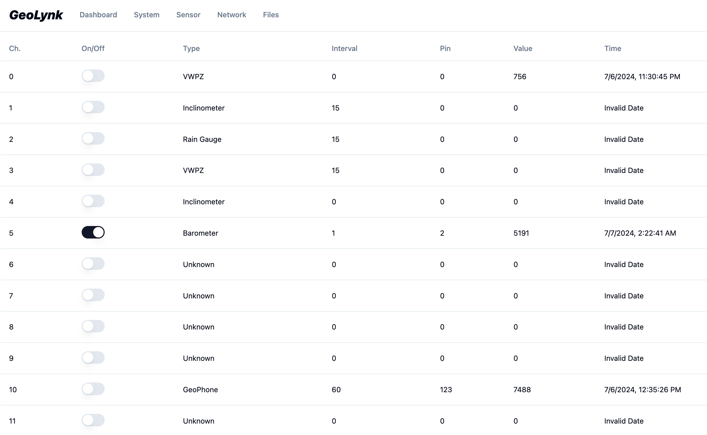
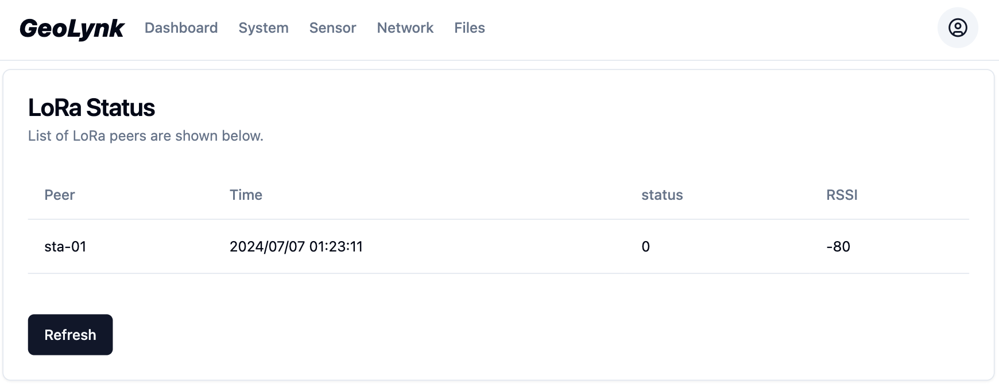
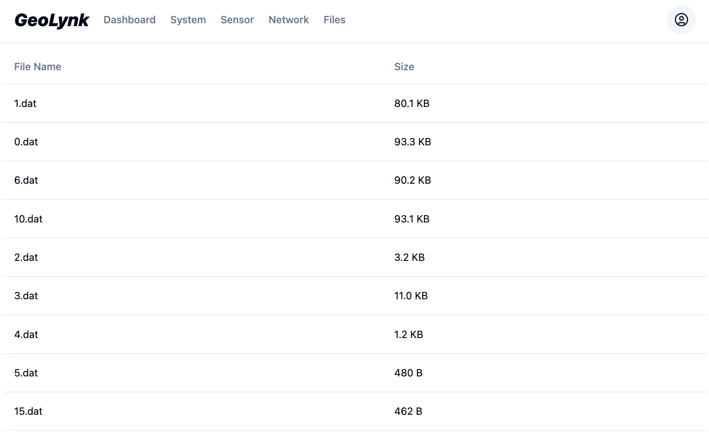

# SenseLynk UI for ESP32

Welcome to the React App for IoT Device Management!

This web application is designed to be hosted on an AWS machine connected to IoT devices, such as Gateways and LoRaWAN Nodes. Its primary purpose is to facilitate status monitoring, configuration, and troubleshooting of IoT devices. Users can leverage this platform to view sensor data, although it's important to note that the data itself is not hosted on the backend (AWS server). Instead, it is stored locally on ESP32 devices. This unique architecture ensures that the AWS server remains lightweight, with computational tasks pushed to the edge of the cloud.

Key Features:
- Status Monitoring: Keep track of the operational status of IoT devices in real-time.
- Configuration Management: Easily configure settings and parameters for connected devices.
- Troubleshooting Tools: Diagnose and address issues with IoT devices efficiently.
- Data Visualization: View sensor data within the web application interface for insights and analysis.
- Enterprise Integration: Enterprise users can connect their own data management systems to ESP32 data loggers through this web application, enabling seamless integration and data exchange. Protocol Support:  MQTT, FTPS, and HTTPS.

By leveraging this web application, users can streamline IoT device management processes, enhance data visibility, and ensure efficient operation of their IoT infrastructure.

## UI Demo
### Sensor Mapping

### Network Management

### File Management

## Components Library
[Shadcn](https://ui.shadcn.com/) provides a collection of reusable components that can be pasted into JSX. Shadcn support CLI install with Vanilla React, usage can be found here [Usage](https://ui.shadcn.com/docs/cli), run `npx shadcn-ui@latest add [component]` to add components.

Configuration with vanilla React requires a dummy `tsconfig.json` file, and @ alias can be setup using `craco.config.js`. `package.json` should then be updated to use craco when running script:
```
  "scripts": {
    "start": "craco start",
    "build": "craco build",
    "test": "craco test",
    "eject": "react-scripts eject"
  },
```

## REST API
### Proxy for Development Environment
One important part of development is to test the api with the backend. However, the backend is most likely also in development on the same machine. This means the react app server and the backend server are on different ports, but the ip address would both the 127.0.0.1 or localhost. If we use `fetch` in react, it would send the request to the react server port, instead of the backend server port. There are multiple ways to resove this, such as adding CORS to the backend, however, using proxy is tested in this project. To set up proxy, add the following into `package.json` in the react app directory. This will ensure the api call be directed to the backend server.
```
  // Mac OS
  "proxy": "http://127.0.0.1:5000",
  // Windows
  "proxy": "http://localhost:5000",
```

## Bundle Size Management
Use gzip to compress js files and serve on embedded systems. Not that mobile devices seems to download the .gz file and do not decompress it, a workaround is to change the file extension to fool the mobile browser but still send the corresponding header file.